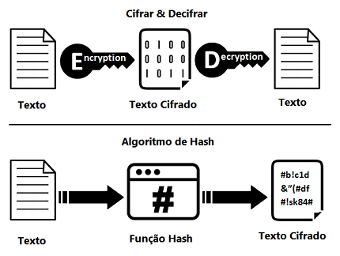

# Pesquisa – Segurança em Aplicações Web com PHP

## Integrantes

- Maria Eduarda Pinto de Oliveira Rodrigues
- Mariana Rasmussen Rezende Alves

---

# Introdução

O desenvolvimento de aplicações web tornou-se essencial para empresas, instituições de ensino, bancos, redes sociais e diversos outros serviços que fazem parte do cotidiano das pessoas. Com o crescimento da utilização da Internet, aumentou também a quantidade de informações pessoais armazenadas nesses sistemas, como nomes, documentos, endereços, dados bancários e senhas. Dessa forma, garantir a segurança dessas informações passou a ser uma das maiores responsabilidades dos desenvolvedores.

A segurança em aplicações web consiste na utilização de técnicas, ferramentas e boas práticas capazes de proteger os sistemas contra ataques cibernéticos, acessos não autorizados e vazamentos de dados. Um sistema inseguro pode causar prejuízos financeiros, danos à reputação das empresas e comprometer a privacidade dos usuários.

O PHP é uma das linguagens de programação mais utilizadas no desenvolvimento de aplicações web e disponibiliza diversos recursos voltados à segurança, como funções para criação de hashes de senhas, criptografia de informações, codificação de dados e mecanismos para prevenção de ataques conhecidos. Além disso, bibliotecas como o OpenSSL permitem implementar soluções robustas para proteger informações confidenciais.

Esta pesquisa apresenta os principais conceitos relacionados à segurança em aplicações web utilizando PHP, abordando técnicas de criptografia, hash, codificação, proteção de senhas, prevenção contra ataques e boas práticas recomendadas para o desenvolvimento de sistemas seguros.

---

# 1. Segurança em Aplicações Web

## O que é Segurança da Informação?

Segurança da informação é o conjunto de práticas, tecnologias e procedimentos utilizados para proteger informações contra acessos não autorizados, alterações indevidas, destruição ou indisponibilidade. Seu objetivo é garantir que os dados permaneçam protegidos durante todo o seu ciclo de vida, desde a coleta até o armazenamento e compartilhamento.

A segurança da informação baseia-se em três princípios fundamentais, conhecidos como Tríade CIA:

### Confidencialidade

A confidencialidade garante que apenas pessoas autorizadas tenham acesso às informações. Isso impede que dados sensíveis sejam visualizados por terceiros.

Como exemplo, apenas o proprietário de uma conta bancária deve conseguir visualizar seu saldo e seu extrato.

### Integridade

A integridade garante que os dados permaneçam corretos e completos, impedindo alterações não autorizadas.

Em um sistema escolar, por exemplo, um aluno não pode modificar suas próprias notas.

### Disponibilidade

A disponibilidade garante que as informações estejam acessíveis sempre que forem necessárias para usuários autorizados.

Um sistema hospitalar precisa permanecer disponível para que médicos tenham acesso ao histórico dos pacientes durante emergências.


*Figura 1 – Os três pilares da Segurança da Informação.*
---

## Por que proteger os dados dos usuários?

As aplicações web armazenam informações extremamente importantes dos usuários, como:

- Nome completo;
- CPF;
- RG;
- Endereço;
- E-mail;
- Número de telefone;
- Senhas;
- Dados bancários;
- Cartões de crédito;
- Histórico de compras.

Caso essas informações sejam roubadas, criminosos podem realizar fraudes financeiras, aplicar golpes, utilizar identidades falsas ou vender esses dados ilegalmente.

Além disso, empresas responsáveis pelo vazamento podem sofrer prejuízos financeiros, perda da confiança dos clientes e sanções legais. No Brasil, a Lei Geral de Proteção de Dados (LGPD) estabelece que organizações devem proteger adequadamente os dados pessoais armazenados.

---

## Principais riscos em aplicações desenvolvidas para Internet

As aplicações web estão constantemente conectadas à Internet e, por isso, tornam-se alvos de diversos ataques.

### SQL Injection

O SQL Injection acontece quando um invasor consegue inserir comandos SQL em campos de entrada da aplicação.

Esses comandos podem permitir acesso indevido ao banco de dados, roubo de informações, alteração de registros ou até exclusão completa das tabelas.

### Cross-Site Scripting (XSS)

O XSS permite que um atacante injete códigos JavaScript maliciosos em páginas da aplicação.

Quando outro usuário acessa essa página, o código é executado automaticamente em seu navegador, podendo roubar cookies, senhas e dados pessoais.

### Cross-Site Request Forgery (CSRF)

Nesse ataque, um usuário autenticado é induzido a executar ações sem perceber, como alterar sua senha ou realizar uma transferência bancária.

Como o navegador já possui uma sessão válida, o servidor acredita que a ação foi realizada pelo próprio usuário.

### Ataques de força bruta

Consistem em testar milhares ou milhões de combinações de senhas automaticamente até descobrir a senha correta.

Quanto mais simples a senha, maior a probabilidade de sucesso.

### Session Hijacking

É o roubo do identificador da sessão do usuário autenticado, permitindo que o invasor utilize sua conta sem conhecer sua senha.

### Malware

Programas maliciosos podem comprometer servidores, computadores e dispositivos dos usuários, roubando informações ou danificando sistemas.

### Vazamento de Dados

Ocorre quando informações confidenciais são expostas devido a falhas de segurança, ataques hackers ou configurações incorretas do sistema.

---

# 2. Criptografia, Hash e Codificação

Embora sejam frequentemente confundidos, criptografia, hash e codificação possuem objetivos completamente diferentes.

| Técnica | Objetivo | Pode ser revertida? | Principal utilização |
|----------|----------|---------------------|----------------------|
| Criptografia | Proteger informações | Sim | Dados confidenciais |
| Hash | Garantir integridade e armazenar senhas | Não | Senhas e validação |
| Codificação | Converter dados para outro formato | Sim | Transmissão de dados |



*Figura 2 – Comparação entre as técnicas utilizadas na proteção de dados.*

## Criptografia

A criptografia transforma uma informação legível em um formato ilegível utilizando um algoritmo matemático e uma chave criptográfica.

Somente quem possui a chave correta consegue recuperar a informação original.

Ela é amplamente utilizada para proteger dados durante sua transmissão e armazenamento.

### Exemplo de utilização

- Internet Banking;
- WhatsApp;
- Comércio eletrônico;
- Sistemas hospitalares;
- Aplicativos de mensagens.

Um algoritmo bastante utilizado atualmente é o **AES (Advanced Encryption Standard)**.

### Exemplo em PHP

```php
$texto = "Mensagem Secreta";
$chave = "1234567890123456";

$criptografado = openssl_encrypt(
    $texto,
    "AES-128-ECB",
    $chave
);
```
### Figura 3 – Funcionamento da Criptografia


*Figura 3 – Processo de criptografia e descriptografia utilizando uma chave.*

## Hash

O hash é uma técnica que transforma uma informação em uma sequência de caracteres de tamanho fixo, chamada de **valor hash** ou **digest**. Diferentemente da criptografia, o hash é um processo **unidirecional**, ou seja, depois que a informação é transformada em hash, não é possível recuperar seu conteúdo original.

Essa característica torna o hash ideal para armazenar senhas. Em vez de salvar a senha digitada pelo usuário, o sistema armazena apenas o hash gerado. Quando o usuário realiza o login, a senha informada é novamente transformada em hash e comparada com o valor armazenado no banco de dados.

Uma característica importante dos algoritmos de hash é que pequenas alterações na informação original geram hashes completamente diferentes.

### Exemplo

Senha:

```text
minhasenha123
```

Hash gerado:

```text
$2y$10$6P5rS7D4Wv5TqJr6v...
```

Mesmo conhecendo o hash, não é possível descobrir a senha original.

### Principais algoritmos de hash

- SHA-256
- SHA-512
- Bcrypt
- Argon2i
- Argon2id

Os algoritmos **Bcrypt** e **Argon2** são os mais recomendados atualmente para armazenamento de senhas, pois foram desenvolvidos especificamente para essa finalidade.

---

## Codificação (Encoding)

A codificação consiste na transformação dos dados para outro formato, permitindo que sejam transmitidos ou armazenados corretamente.

Ao contrário da criptografia, a codificação **não possui objetivo de segurança**.

Qualquer pessoa que conheça o método utilizado consegue recuperar facilmente os dados originais.

Um dos métodos mais conhecidos é o **Base64**, muito utilizado para transmitir arquivos, imagens e informações em formato texto.

### Exemplo

Texto original:

```text
Olá Mundo
```

Codificado em Base64:

```text
T2zDoSBNdW5kbw==
```

Decodificando novamente:

```text
Olá Mundo
```

Por esse motivo, Base64 não deve ser utilizado para proteger senhas ou informações confidenciais.

---

# 3. Funções de Hash no PHP

O PHP oferece diversas funções que facilitam a criação e verificação de hashes. Essas funções seguem recomendações modernas de segurança e são amplamente utilizadas em sistemas de autenticação.

## password_hash()

A função `password_hash()` é utilizada para criar um hash seguro de uma senha.

Ela aplica automaticamente um algoritmo recomendado pelo PHP e adiciona um **salt** aleatório, aumentando a segurança.

### Sintaxe

```php
password_hash($senha, PASSWORD_DEFAULT);
```

### Exemplo

```php
$senha = "MinhaSenha123";

$hash = password_hash($senha, PASSWORD_DEFAULT);

echo $hash;
```

### Para que serve?

- Armazenar senhas no banco de dados.
- Proteger contra ataques de força bruta.
- Gerar hashes seguros automaticamente.

### Quando utilizar?

Sempre que uma senha for cadastrada ou alterada.

---

## password_verify()

Depois que a senha foi armazenada em forma de hash, não é possível compará-la utilizando o operador `==`.

Para isso existe a função `password_verify()`, responsável por verificar se a senha digitada corresponde ao hash armazenado.

### Sintaxe

```php
password_verify($senhaDigitada, $hash);
```

### Exemplo

```php
if(password_verify($senhaDigitada, $hash)){
    echo "Login realizado com sucesso!";
}else{
    echo "Senha incorreta.";
}
```

### Para que serve?

Realizar a autenticação de usuários durante o login.

### Quando utilizar?

Sempre que o usuário informar sua senha para acessar o sistema.

---

## hash()

A função `hash()` permite gerar hashes utilizando diversos algoritmos criptográficos.

### Sintaxe

```php
hash("sha256", "Texto");
```

### Exemplo

```php
$texto = "Documento";

echo hash("sha256", $texto);
```

### Para que serve?

- Verificar integridade de arquivos.
- Gerar assinaturas digitais.
- Validar informações.
- Comparar conteúdos.

Embora seja uma função segura para integridade de dados, ela **não deve ser utilizada para armazenar senhas**, pois não possui mecanismos específicos de proteção contra ataques modernos.

---

## Algoritmos recomendados atualmente

O PHP recomenda principalmente os seguintes algoritmos para armazenamento de senhas:

### Bcrypt

Foi durante muitos anos o algoritmo padrão do PHP.

Possui alto nível de segurança e dificulta ataques de força bruta.

### Argon2i

Criado para aumentar ainda mais a proteção das senhas.

É resistente a diversos tipos de ataques.

### Argon2id

Atualmente é considerado um dos algoritmos mais seguros para armazenamento de senhas, combinando vantagens do Argon2i e Argon2d.

O algoritmo utilizado por `PASSWORD_DEFAULT` poderá mudar futuramente conforme novas recomendações de segurança surgirem.

---

# 4. Funções de Codificação

O PHP disponibiliza funções específicas para codificar e decodificar dados utilizando Base64.

## base64_encode()

A função `base64_encode()` converte dados binários ou textos para o formato Base64.

### Exemplo

```php
$texto = "PHP é incrível!";

echo base64_encode($texto);
```

Resultado:

```text
UEhQIMOpIGluY3LDrXZlbCE=
```

### Para que serve?

É utilizada para:

- Enviar arquivos por e-mail.
- Armazenar imagens em formato texto.
- Transmitir informações em APIs.
- Converter dados binários.

---

## base64_decode()

Essa função realiza o processo inverso, recuperando o conteúdo original.

### Exemplo

```php
$codigo = "UEhQIMOpIGluY3LDrXZlbCE=";

echo base64_decode($codigo);
```

Resultado:

```text
PHP é incrível!
```

---

## Por que Base64 não é criptografia?

Muitas pessoas acreditam que Base64 protege informações, porém isso é um erro.

A codificação Base64 apenas altera a representação dos dados.

Qualquer pessoa pode utilizar uma ferramenta online ou uma função da própria linguagem para recuperar imediatamente o conteúdo original.

Por esse motivo, Base64 nunca deve ser utilizado para proteger:

- Senhas;
- Dados bancários;
- Informações pessoais;
- Documentos sigilosos.

Sempre que houver necessidade de proteção real, deve-se utilizar criptografia.

---

# 5. Criptografia no PHP

O PHP possui suporte à biblioteca **OpenSSL**, responsável por implementar diversos algoritmos modernos de criptografia.

## O que é OpenSSL?

OpenSSL é uma biblioteca de código aberto utilizada para implementar protocolos de segurança e algoritmos criptográficos.

Ela é amplamente utilizada em servidores web, sistemas bancários, certificados digitais e aplicações que necessitam proteger informações confidenciais.

## Para que serve?

A biblioteca OpenSSL permite:

- Criptografar informações;
- Descriptografar dados;
- Gerar certificados digitais;
- Criar assinaturas digitais;
- Implementar comunicação segura utilizando SSL/TLS.

Esses recursos são fundamentais para proteger informações durante sua transmissão pela Internet.

## Principais funções

### openssl_encrypt()

Utilizada para criptografar informações.

Exemplo:

```php
$texto = "Mensagem confidencial";
$chave = "1234567890123456";

$dados = openssl_encrypt(
    $texto,
    "AES-128-ECB",
    $chave
);
```

### openssl_decrypt()

Recupera o conteúdo original utilizando a mesma chave empregada na criptografia.

Exemplo:

```php
$texto = openssl_decrypt(
    $dados,
    "AES-128-ECB",
    $chave
);
```

Essas funções são muito utilizadas em sistemas bancários, aplicações corporativas e plataformas que precisam proteger informações sensíveis durante o armazenamento ou transmissão.

---

## Comunicação segura com HTTPS

O protocolo **HTTPS (HyperText Transfer Protocol Secure)** utiliza o protocolo **TLS (Transport Layer Security)** para criptografar a comunicação entre o navegador e o servidor. Dessa forma, informações como senhas, dados bancários e informações pessoais são transmitidas de forma segura, reduzindo o risco de interceptação por terceiros.

### Figura 4 – Funcionamento do HTTPS

![Funcionamento do HTTPS]](imagens/imagem4.png).

*Figura 4 – Comunicação segura entre cliente e servidor utilizando o protocolo HTTPS.*

---
---


# 6. Proteção de Senhas

As senhas representam uma das principais formas de autenticação em aplicações web. Por esse motivo, devem ser armazenadas de maneira segura, evitando que possam ser recuperadas caso ocorra um vazamento do banco de dados.

## Como uma senha deve ser armazenada corretamente?

Uma senha **nunca deve ser salva em texto puro (Plain Text)**. O correto é armazenar apenas seu **hash**, utilizando funções próprias do PHP, como `password_hash()`.

Dessa forma, mesmo que o banco de dados seja invadido, os criminosos não terão acesso às senhas originais dos usuários.

### Exemplo correto

```php
$senha = "MinhaSenha123";

$hash = password_hash($senha, PASSWORD_DEFAULT);
```

No banco de dados será armazenado apenas o hash.

---
### Fluxograma do armazenamento de senhas

```text
Usuário
     │
     ▼
 Digita a senha
     │
     ▼
password_hash()
     │
     ▼
Banco de Dados
     │
     ▼
password_verify()
     │
     ▼
Login autorizado
```

## Por que nunca devemos salvar senhas em texto puro?

Salvar senhas diretamente no banco de dados representa um enorme risco de segurança.

Caso um invasor consiga acessar o banco, todas as senhas poderão ser visualizadas imediatamente.

Isso pode causar diversos problemas, como:

- Roubo de contas;
- Fraudes financeiras;
- Vazamento de informações pessoais;
- Acesso indevido a outros sistemas, já que muitos usuários reutilizam suas senhas.

Por esse motivo, utilizar funções de hash é considerado uma prática obrigatória.

---

## O que é Salt?

O **Salt** é um valor aleatório adicionado à senha antes da geração do hash.

Sua função é impedir que duas pessoas com a mesma senha tenham exatamente o mesmo hash armazenado.

Além disso, o Salt dificulta ataques utilizando tabelas pré-computadas, conhecidas como **Rainbow Tables**.

O PHP gera automaticamente um Salt quando utilizamos a função `password_hash()`.

---

## O que torna um algoritmo de hash seguro?

Um algoritmo de hash seguro deve possuir diversas características importantes:

- Ser resistente à descoberta da senha original;
- Produzir hashes únicos para pequenas alterações na entrada;
- Ser lento o suficiente para dificultar ataques de força bruta;
- Utilizar Salt automaticamente;
- Permitir atualização do custo computacional conforme o avanço do hardware.

Os algoritmos **Bcrypt** e **Argon2id** atendem a esses requisitos e são recomendados atualmente.

---

# 7. Proteção contra Ataques

Durante o desenvolvimento de aplicações PHP, é necessário adotar medidas que reduzam os riscos de ataques cibernéticos.

## SQL Injection

### O que é?

SQL Injection é um ataque no qual comandos SQL maliciosos são inseridos em campos de entrada da aplicação.

Caso o sistema não valide corretamente as informações, esses comandos poderão ser executados pelo banco de dados.

### Exemplo

Um invasor pode inserir:

```sql
' OR '1'='1
```

Caso a consulta seja construída incorretamente, todos os registros poderão ser retornados.

### Como prevenir?

- Utilizar Prepared Statements;
- Utilizar parâmetros nas consultas;
- Validar dados recebidos;
- Nunca concatenar SQL com dados informados pelo usuário.

Exemplo utilizando PDO:

```php
$sql = $pdo->prepare("SELECT * FROM usuarios WHERE email = ?");
$sql->execute([$email]);
```

---

## Cross-Site Scripting (XSS)

### O que é?

O XSS ocorre quando um invasor consegue inserir códigos JavaScript maliciosos em páginas da aplicação.

Esses códigos serão executados no navegador de outros usuários.

### Consequências

- Roubo de cookies;
- Roubo de sessões;
- Captura de senhas;
- Redirecionamentos para páginas falsas.

### Como prevenir?

- Escapar dados utilizando `htmlspecialchars()`;
- Validar entradas do usuário;
- Evitar exibir HTML enviado pelos usuários.

Exemplo:

```php
echo htmlspecialchars($nome);
```

---

## Cross-Site Request Forgery (CSRF)

### O que é?

O CSRF acontece quando um usuário autenticado executa ações sem perceber, induzido por um site malicioso.

Como o navegador já possui uma sessão válida, o servidor acredita que a ação foi realizada pelo próprio usuário.

### Como prevenir?

- Utilizar Tokens CSRF;
- Verificar origem das requisições;
- Utilizar cookies seguros.

---

# 8. Aplicações Práticas

Os recursos de segurança estudados são utilizados diariamente em diversos sistemas.

## Sistemas de Login

As senhas são armazenadas utilizando `password_hash()` e verificadas com `password_verify()`.

Isso impede que as senhas fiquem expostas no banco de dados.

---

## Comércio Eletrônico

Lojas virtuais armazenam dados de clientes, pedidos e pagamentos.

A criptografia protege informações financeiras durante a transmissão pela Internet.

---

## Internet Banking

Os bancos utilizam criptografia avançada para proteger transferências, saldos, extratos e autenticação dos clientes.

Além disso, utilizam certificados digitais e conexões HTTPS para impedir interceptações.

---

## Redes Sociais

Redes sociais armazenam milhões de informações pessoais.

Por isso utilizam:

- Hash de senhas;
- Criptografia;
- Autenticação em dois fatores;
- Monitoramento constante de acessos.

---

## Sistemas Escolares

Escolas e universidades armazenam notas, frequência, documentos e dados pessoais.

Essas informações precisam permanecer protegidas para garantir a privacidade dos alunos.

---

## Sistemas de Gerenciamento de Usuários

Empresas utilizam autenticação segura para controlar permissões de acesso.

Cada usuário possui níveis diferentes de autorização, evitando acesso indevido às informações.

---

# 9. Boas Práticas de Segurança

Algumas recomendações são fundamentais para desenvolver aplicações PHP mais seguras.

## Validar todas as entradas

Nunca confiar nos dados enviados pelos usuários.

Todas as informações devem ser verificadas antes de serem utilizadas.

---

## Utilizar Prepared Statements

As consultas preparadas impedem ataques de SQL Injection.

Sempre devem ser utilizadas ao acessar bancos de dados.

---

## Proteger Sessões

É importante utilizar:

- Cookies seguros;
- Expiração automática da sessão;
- Regeneração do ID da sessão após o login.

---

## Utilizar HTTPS

O protocolo HTTPS criptografa toda a comunicação entre navegador e servidor.

Assim, terceiros não conseguem interceptar as informações transmitidas.

---

## Manter o PHP atualizado

Novas versões corrigem vulnerabilidades e melhoram a segurança da linguagem.

Atualizações frequentes reduzem os riscos de ataques.

---

## Proteger arquivos de configuração

Arquivos contendo senhas de banco de dados e chaves criptográficas nunca devem ficar acessíveis publicamente.

Essas informações devem permanecer fora da pasta pública da aplicação.

---

## Realizar backups

Backups periódicos permitem recuperar informações em caso de falhas ou ataques.

Também devem ser protegidos por criptografia.

---

# 10. Conclusão

A segurança em aplicações web é indispensável para garantir a proteção das informações dos usuários e o funcionamento adequado dos sistemas. À medida que cresce o número de ataques cibernéticos, torna-se cada vez mais importante utilizar técnicas e ferramentas capazes de reduzir vulnerabilidades e impedir acessos não autorizados.

Durante esta pesquisa foi possível compreender as diferenças entre criptografia, hash e codificação, além de conhecer as principais funções disponibilizadas pelo PHP para proteção de dados. Também foi possível entender a importância do armazenamento correto de senhas utilizando `password_hash()` e `password_verify()`, da utilização da biblioteca OpenSSL para criptografia e das boas práticas para prevenir ataques como SQL Injection, XSS e CSRF.

Entre todos os recursos pesquisados, o armazenamento seguro de senhas utilizando algoritmos modernos de hash pode ser considerado um dos mais importantes, pois protege diretamente a autenticação dos usuários e reduz significativamente os impactos de possíveis vazamentos de banco de dados.

Conclui-se que o desenvolvimento seguro deve fazer parte de todas as etapas da criação de aplicações web. A utilização correta das funções do PHP, aliada às boas práticas de programação e à atualização constante dos sistemas, contribui para aplicações mais confiáveis, protegidas e preparadas para enfrentar os desafios da segurança da informação.

---

# Referências

BRASIL. **Lei nº 13.709, de 14 de agosto de 2018. Lei Geral de Proteção de Dados Pessoais (LGPD).** Disponível em: <https://www.planalto.gov.br/>. Acesso em: 03 jul. 2026.

OWASP FOUNDATION. **OWASP Top 10: The Ten Most Critical Web Application Security Risks.** Disponível em: <https://owasp.org/>. Acesso em: 03 jul. 2026.

PHP. **PHP Manual.** Disponível em: <https://www.php.net/manual/pt_BR/>. Acesso em: 03 jul. 2026.

OpenSSL Project. **OpenSSL Documentation.** Disponível em: <https://www.openssl.org/docs/>. Acesso em: 03 jul. 2026.

STALLINGS, William. **Criptografia e Segurança de Redes: Princípios e Práticas.** 7. ed. São Paulo: Pearson.

TANENBAUM, Andrew S.; WETHERALL, David. **Redes de Computadores.** 5. ed. São Paulo: Pearson.
